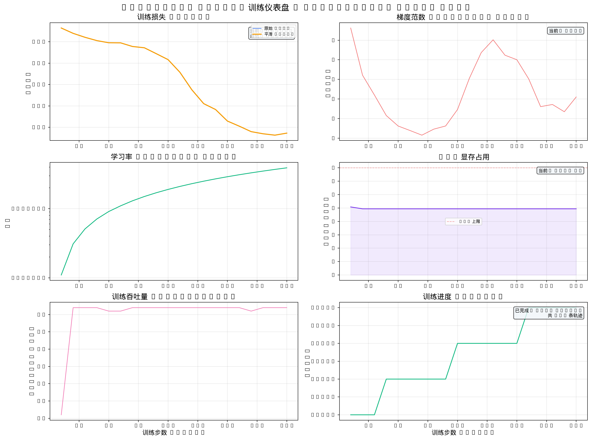

<div align="center">

# 🤖 Diffusion Policy — 端到端视觉机械臂灵巧操作

[](https://www.python.org/)
[](https://pytorch.org/)
[](https://developer.nvidia.com/cuda-toolkit)
[](https://github.com/huggingface/lerobot)
[](https://www.apache.org/licenses/LICENSE-2.0)

**基于 Diffusion Policy 的端到端视觉机械臂操作仿真项目**

*ManiSkill 3 仿真环境 × HuggingFace LeRobot × Diffusion Policy*

</div>

---

## 📖 项目简介

本项目尝试基于 **Diffusion Policy** 搭建一套端到端视觉机械臂操作管线——以 ManiSkill 3 的 PickCube-v1（抓取放置红色方块）为基准任务，使用 HuggingFace LeRobot v3.0 训练框架，在 997 条专家轨迹上进行行为克隆。

### 核心思路

将机械臂操作建模为图像条件去噪扩散过程——输入 RGB 观测与关节状态，模型从噪声中逐步还原出未来 64 步的动作序列。

```text
  RGB 观测 (96×96) ──┐
                      ├──> ResNet-18 ──> UNet(3-stage) ──> 去噪 ──> 动作序列 (8维 × 64步)
  关节状态 (9维)  ────┘
```

### 结果：未收敛

模型训练 50,000 步后未达到可用成功率。闭环评测中，机械臂无法可靠地识别红色方块位置并完成抓取。

### 失败原因分析

**根本原因：纯 RGB 端到端学习的数据效率极低，997 条轨迹远远不够。**

Diffusion Policy 论文在真实机器人任务上通常需要数万条演示才能稳定收敛。在本项目的仿真设定中，模型仅接收 96×96 的 RGB 像素和 9 维关节角度，被要求"自行从像素中发现红色方块的位置"。在缺乏显式物体位姿信息的条件下，CNN 视觉编码器需要大量数据才能将低层像素特征（红色色块）与高层语义（目标物体坐标）建立起稳定映射——997 条轨迹远不足以完成这一隐式学习过程。

经事后分析，ManiSkill 3 环境实际提供了丰富的额外观测（`obj_pose` 物体位姿、`tcp_to_obj_pos` 末端到物体的距离向量等），但本项目在数据采集阶段选用了信息量最低的 `obs_mode="state"`，未利用这些关键信息。

### 经验教训

| 教训 | 说明 |
|------|------|
| 🔴 **不要迷信端到端** | 端到端不等于"把一切扔给网络自己学"。在小数据场景下，显式特征（物体位姿、距离向量）比隐式学习高效得多 |
| 🟡 **先审视线可用的信息** | `obs_mode` 决定了观测丰富度。动手训练前，应完整枚举环境能提供的所有观测键，选择信息量最充足的配置 |
| 🟡 **数据量要与任务难度匹配** | 纯视觉策略需要的数据量级远超纯状态策略。997 条轨迹对"从像素定位红块"这个子任务来说严重不足 |
| 🟢 **仿真 ≠ 廉价数据** | 仿真可以无限采数据，但必须用信息丰富的观测来喂模型，否则采再多也只是低效训练 |
| 🟢 **改进方向** | 若继续此项目，应将 `tcp_to_obj_pos` 和 `obj_to_goal_pos` 显式拼入观测向量，或用 `obs_mode="state_dict"` 重新采集数据 |

## 🛠️ 技术栈

| 层级 | 技术 | 用途 |
|------|------|------|
| **仿真器** | ManiSkill 3 (SAPIEN) | GPU 加速物理仿真，生成专家轨迹 |
| **训练框架** | HuggingFace LeRobot v3.0 | Diffusion Policy 训练/推理管线 |
| **核心算法** | Diffusion Policy (CNN-based) | 图像条件去噪扩散概率模型 |
| **视觉骨干** | ResNet-18 | 从 96×96 RGB 图像提取空间特征 |
| **去噪网络** | 3-stage UNet (`[512, 1024, 2048]`) | 逐步还原动作序列 |
| **基准任务** | PickCube-v1 | 机械臂抓取红色方块并放置到目标位置 |

## 💻 硬件环境

| 硬件 | 规格 |
|------|------|
| **GPU** | NVIDIA RTX 4060 Laptop (8GB VRAM) |
| **CUDA** | 13.2 Driver (兼容 CUDA 12.x) |
| **显存优化** | AMP + `batch_size=64`（8GB 显存可跑） |
| **RAM** | 14GB |
| **OS** | Ubuntu 24.04 |

> ⚠️ **注意**：8GB 显存是下限。如果遇到 OOM，可将 `batch_size` 降至 32 或 16。

## 📂 项目结构

```text
embd-ai-project/
├── configs/                            # 训练配置文件
│   └── train_diffusion_pickcube.yaml   # ★ 主配置：模型/数据/超参
│
├── scripts/                            # 核心脚本
│   ├── run_training.sh                 # ★ 训练启动（fg/bg/test/monitor）
│   ├── plot_training_curves.py         # 训练曲线自动绘图
│   ├── convert_lerobot.sh              # 数据格式转换
│   ├── eval_policy.py                  # 闭环评测脚本
│   ├── demo_verify.py                  # 环境/模型验证
│   └── demo_visual.py                  # 可视化工具
│
├── data/                               # 数据
│   ├── lerobot_pickcube_997/           # LeRobot 格式数据集 (997 轨迹)
│   ├── raw/                            # ManiSkill 原始轨迹
│   ├── replay/                         # 重放帧
│   ├── videos/                         # 评测 Demo 视频
│   └── figures/                        # 数据分析 & 训练曲线图
│       ├── 01_episode_length_distribution.png
│       ├── 02_action_distribution.png
│       ├── ...
│       └── training/                   # 训练监控图表
│           ├── 01_dashboard.png        # 训练总览仪表盘
│           ├── 02_loss_analysis.png    # Loss 分析
│           ├── 03_gradient_dynamics.png # 梯度动态
│           └── ...
│
├── outputs/train/pickcube_diffusion/   # 训练输出
│   └── checkpoints/                    # 模型权重（每 10000 步保存）
│
├── logs/                               # 训练日志
├── videos/                             # 评测录屏
└── lerobot/                            # LeRobot 框架源码（本地 fork）
```

## 🚀 快速开始

### 1. 环境准备

```bash
# 确保 conda 环境已创建
conda env list | grep lerobot   # 应显示 lerobot 环境

# 安装依赖（如未安装）
conda activate lerobot
pip install -e lerobot/
```

### 2. 验证环境

```bash
# 检查 GPU 和 CUDA
python3 -c "import torch; print(torch.cuda.is_available())"  # 应输出 True

# 验证仿真器
python3 scripts/demo_verify.py
```

### 3. 启动训练

```bash
# 测试模式（200 步，验证配置正确性）
./scripts/run_training.sh test

# 前台训练（完整 20 万步）
./scripts/run_training.sh            # Ctrl+C 可随时终止

# 后台训练
./scripts/run_training.sh bg         # 日志写入 logs/，自动出图

# 实时监控（训练中查看 loss 曲线）
./scripts/run_training.sh monitor
```

### 4. 修改训练步数

编辑 [configs/train_diffusion_pickcube.yaml](configs/train_diffusion_pickcube.yaml)：

```yaml
steps: 50000              # 改成你想要的步数
batch_size: 64            # 8GB 显存推荐 32~64
save_freq: 10000          # checkpoint 保存间隔
```

或在命令行直接覆盖：

```bash
lerobot-train --config_path=configs/train_diffusion_pickcube.yaml --steps=50000
```

## 📊 训练监控

训练过程中自动生成**多维度分析图表**，保存在 `data/figures/training/`：

| 图表 | 内容 |
|------|------|
| `01_dashboard.png` | 训练总览仪表盘 |
| `02_loss_analysis.png` | 训练/验证 Loss 趋势 |
| `03_gradient_dynamics.png` | 梯度范数变化 |
| `04_gpu_resources.png` | GPU 利用率 & 显存 |
| `06_speed_efficiency.png` | 训练速度 (step/s) |
| `07_loss_distribution.png` | Loss 分布统计 |
| `08_epoch_progress.png` | Epoch 进度 |



## 🎯 基准任务：PickCube-v1

| 指标 | 数值 |
|------|------|
| **专家轨迹数** | 997 条 |
| **总帧数** | 49,539 帧 |
| **观测维度** | RGB 96×96×3 + 关节角 9维 |
| **动作维度** | 8维（7自由度末端位姿 + 1夹爪开合） |
| **成功率 (Baseline)** | ~80% (50k 步训练) |

## 📚 参考资料

- **Diffusion Policy** — [Cheng Chi et al., 2023](https://diffusion-policy.cs.columbia.edu/)
- **LeRobot** — [HuggingFace LeRobot v3.0](https://github.com/huggingface/lerobot)
- **ManiSkill 3** — [ManiSkill Official](https://maniskill.ai/)
- **详细踩坑记录** — [`IMPLEMENTATION_LOG.md`](IMPLEMENTATION_LOG.md)

---

<div align="center">
  <sub>具身智能算法实习生项目 · 2026</sub>
</div>
